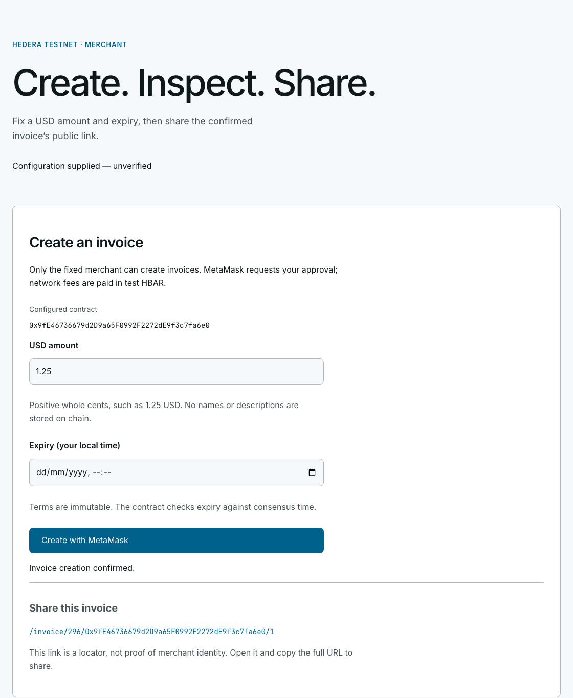
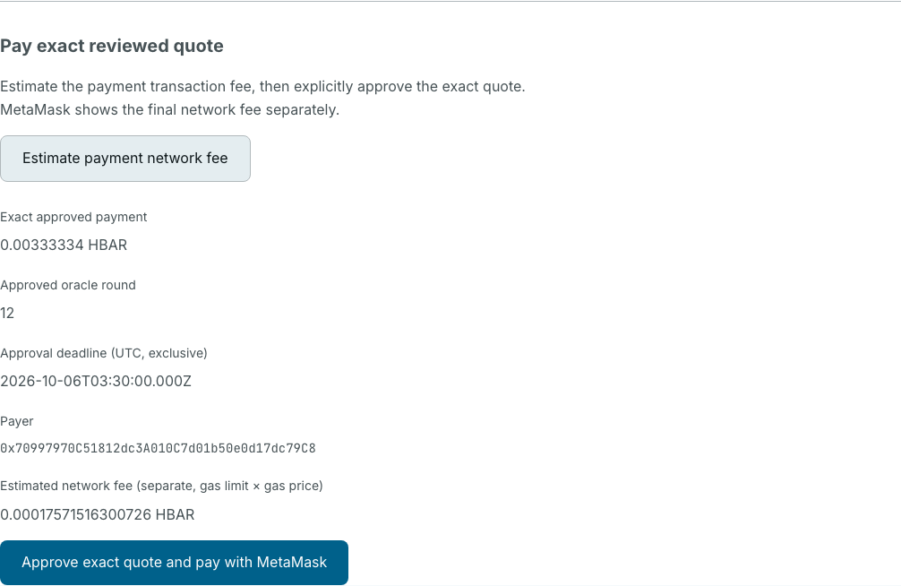
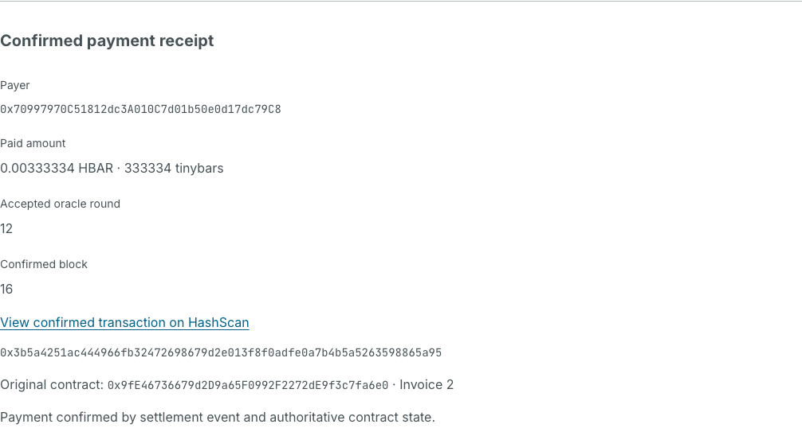

# HBAR Invoices

Create USD-reference invoices and accept HBAR payments on Hedera testnet. Learn how a familiar web invoice workflow connects to smart contracts, oracle quotes, MetaMask approval and confirmed payment receipts.



_Application screenshots use a disposable local EVM, simulated wallet and oracle, and explicit test relay conversion. They illustrate the interface; they are not Hedera testnet transaction evidence._

<details>
<summary>See exact quote approval and the payment receipt</summary>

**Review the exact payment, oracle round, deadline and separate network fee before approval.**



**A confirmed receipt identifies the payer, amount, accepted round and settlement transaction.**



</details>

[Quick Start](#quick-start) · [Usage](#usage) · [Verified testnet example](#verified-testnet-example) · [Contributing](#contributing)

## Motivation

For a developer who knows web applications, an invoice is a familiar starting point: create a payment request, share a link and check whether it was paid. HBAR Invoices uses that workflow to make learning Hedera concrete. Each step introduces a useful concept: deploying a contract, enforcing merchant authorization, reading an HBAR/USD oracle, approving an exact native payment and verifying settlement. The project brings these concepts together in a reusable scaffold-hbar template, with separate contract and frontend workspaces and tests you can run before funding a wallet.

## What you can build and learn

- **Create and share invoices.** One merchant sets an immutable USD amount and expiry. Anyone can inspect an invoice link without connecting a wallet.
- **Read contract-derived quotes.** The contract converts USD cents into an exact HBAR amount using a validated Chainlink reference price. Invalid or stale data blocks payment.
- **Approve one exact payment.** A separate payer reviews the quote, oracle round, deadline and estimated network fee before submitting through MetaMask.
- **Verify settlement.** The contract marks an invoice settled only when the full payment reaches the merchant. The UI verifies the settlement event and contract state before showing a receipt.
- **Handle interrupted transactions.** Pending attempts survive reload. Recovery checks the original transaction before allowing another payment.
- **Reuse the boundaries.** Adapt the frontend while keeping pricing, authorization and settlement rules in the contract.

This example integrates **Hedera Smart Contract Service, native HBAR payments and a Chainlink HBAR/USD feed**. It supports Hedera testnet, with one fixed merchant per deployment.

## Quick Start

Use **Node 24.10.0 and npm 11.6.1**. You also need Git with `user.name` and `user.email` configured, public GitHub/npm access and available disk space. Run `nvm use` if you use nvm in this repository.

### 1. Generate the application

```sh
npm create scaffold-hbar@latest -- hbar-invoices --template MrSufferer/scaffold-hbar --frontend nextjs-app --solidity-framework hardhat --package-manager npm --network testnet --skip-install --skip-hedera-skills --yes
cd hbar-invoices
npm ci
```

### 2. Start the frontend

```sh
npm run dev
```

Open [localhost:3000](http://localhost:3000), then visit [/setup](http://localhost:3000/setup). A fresh project shows **Configuration needed** and explains the testnet prerequisites. You can start the frontend without a wallet, secrets or funds. Stop it with Ctrl+C.

To check and serve a production build:

```sh
npm run format
npm run check-types
npm test
npm run lint
npm run build
npm run start
```

The generated project intentionally omits `template.json`; that manifest belongs in the source template. The CLI also adjusts package-manager metadata and workspace scripts for npm.

## Usage

### 1. Prepare two testnet wallets

Use separate **merchant** and **payer** accounts in MetaMask, connected to Hedera testnet: chain ID **296**, native currency **HBAR**. Fund both with test HBAR. The merchant needs network fees; the payer needs the invoice amount plus network fees.

The default public RPC is `https://testnet.hashio.io/api`. Confirm RPC availability and the fixed feed's current identity and validity before deployment. Follow [the deployment prerequisites](docs/invoice-creation.md#prepare-the-merchant) for the complete checks.

### 2. Deploy as the merchant

Open `/deploy`, select the merchant account and choose **Deploy with MetaMask**. The approving account becomes the fixed merchant and payment recipient. Wait for confirmed deployment and retain the contract address and transaction hash. The wallet signs deployment; no private deployment key is needed in the workspace.

Create a private frontend configuration file:

```sh
cp packages/nextjs/.env.example packages/nextjs/.env.local
```

Set `NEXT_PUBLIC_HEDERA_RPC_URL` to a public HTTPS endpoint and `NEXT_PUBLIC_INVOICE_CONTRACT` to the confirmed contract address. Restart development mode, or rebuild and restart production mode. `/setup` shows the configured values; configuration alone does not verify the deployment.

`NEXT_PUBLIC_*` values are public. Keep keys and credential-bearing URLs out of them. Runtime dotenv files are ignored and excluded from template packaging, even when empty.

### 3. Create and share an invoice

Open `/merchant`. Enter **1.25 USD** and a future expiry, choose **Create with MetaMask**, then approve once. After the matching creation event confirms, the application provides an invoice link:

```text
/invoice/296/0xCONTRACT/INVOICE_ID
```

Share the full URL. A payer can inspect the amount, expiry, merchant, recipient, state and quote without a wallet. The link keeps its original network, contract and invoice ID; changing app configuration does not redirect it.

### 4. Review and pay as the payer

Open the invoice link with the payer account. Check the original contract and recipient, USD amount, exact HBAR amount, oracle round and quote deadline. Choose **Estimate payment network fee**, review the separate fee, then choose **Approve exact quote and pay with MetaMask**.

Use the actual contract quote. The reference price is not a live spot guarantee, and quotes last at most five minutes. A changed oracle round or expired quote requires a fresh review and explicit approval. The contract checks the exact quote again during settlement.

Expected result: the invoice becomes **Settled** and a **Confirmed payment receipt** shows the payer, paid amount, accepted round, block and transaction link. A submitted hash alone is pending payment, not settlement or a receipt.

### 5. Cancel an unpaid invoice

Create a second **1.25 USD** invoice. Open its link as the merchant, choose **Cancel with MetaMask** and approve once. After the matching cancellation event confirms, refresh the link in a wallet-free browser: it shows **Cancelled** and offers no checkout. Cancellation is permanent; settled invoices cannot be cancelled.

### 6. Recover after a reload

If a transaction was submitted, keep the original invoice link and transaction reference. After reload, use **Check creation transaction**, **Check cancellation transaction** or **Check payment transaction**, as applicable.

A timeout or missing receipt does not prove failure. Unknown outcomes block retries. A confirmed payment revert requires an authoritative invoice read and a fresh quote and fee review before another attempt. See [payment failure actions](docs/invoice-payment.md#payment-failure-actions) for the next permitted action in each case.

The detailed guides cover [deployment, creation and cancellation](docs/invoice-creation.md), [quote validation](docs/invoice-quotes.md) and [payment and receipt verification](docs/invoice-payment.md).

## Verified testnet example

The **October 5, 2026** real MetaMask run recorded a successful **$1.25 invoice payment**, exact merchant delivery, receipt recovery after reload and cancellation of a second invoice.

| Recorded item          | Evidence                                                                                                                                                                                |
| ---------------------- | --------------------------------------------------------------------------------------------------------------------------------------------------------------------------------------- |
| Application source     | `efa23ae5a6fe53bc0a2ee5154422cf23f58940e8`                                                                                                                                              |
| Tool versions          | scaffold-hbar CLI 0.4.1; Node 24.10.0; npm 11.6.1; MetaMask 13.17.0                                                                                                                     |
| Testnet contract       | `0x3467c4A13171B1216691D37B2C3E69d05133E9e8`                                                                                                                                            |
| Invoice 6 settlement   | **12.15433438 HBAR**, round `18446744073709596754`; [confirmed transaction](https://hashscan.io/testnet/transaction/0x5b520a58f3c47cad5bced83d7f6121423f2052d6e770ae549361745ca955c1c4) |
| Invoice 7 cancellation | [Confirmed cancellation](https://hashscan.io/testnet/transaction/0x6d95c80b12b94a459172ed513159502a30845ecd965ead9236ac49cb559eff94)                                                    |

The HBAR amount above is a historical observed quote, not an amount to reuse. Inspect [the real MetaMask record](docs/verification/2026-10-05-final-metamask.json), [the testnet walkthrough](docs/testnet-automation.md) and [the final audit](docs/verification/final-audit.md) for source revisions, checks and evidence limits. These dated transactions do not establish current RPC or oracle availability.

## Supported stack

| Layer              | Tested versions                                 |
| ------------------ | ----------------------------------------------- |
| Runtime            | Node 24.10.0, npm 11.6.1                        |
| Frontend           | Next.js 15.5.27, React 19.2.3                   |
| Contracts          | Hardhat 2.22.19, ethers 6.14.0, Solidity 0.8.28 |
| Network and wallet | Hedera testnet, MetaMask                        |

Only the Next.js + Hardhat + npm combination is supported. Direct dependencies and `package-lock.json` are pinned; install with `npm ci`. See [baseline provenance](docs/baseline.md) and [brand guidelines](brand.md).

## Verification

Run the reusable clean-generation gate from an installed source checkout or generated project:

```sh
npm run verify:template -- --report /tmp/hbar-invoices-public/report.json
```

It generates from the public default ref using the published CLI, validates the source manifest and packaging, installs a fresh project, runs formatting/typechecks/tests/lint/build, boots production and checks the browser journey. It requires Git, OpenSSL with `req -addext` support, public npm/browser-download access and Chromium system libraries. See [browser prerequisites](docs/invoice-creation.md#verify-the-generated-journey).

For a committed local change and a published candidate, respectively:

```sh
npm run verify:template -- --local --ref HEAD --report /tmp/hbar-invoices-local/report.json
npm run verify:template -- --ref YOUR_PUBLIC_REF --report /tmp/hbar-invoices-candidate/report.json
```

Local mode exports tracked files from the committed revision; uncommitted changes are excluded. It cannot replace public candidate or default-ref verification. The CLI schema adapter is locked to release 0.4.1 and requires review when the published release changes.

Reports preserve source commits, dates, tool versions, commands and stage results. Read the matching log when a stage fails; later stages that did not run cannot count as passing. Source packaging, generated-project behavior and real testnet settlement are separate evidence. [Recorded verification results](docs/verification/README.md) keep those distinctions visible.

To reproduce local stale-feed, expired-quote and recovery behavior in an already built source checkout, install the pinned Chromium browser and run:

```sh
npx playwright install chromium
npm run test:journey
```

This journey uses simulated wallets, a controllable oracle and a disposable local EVM with explicit test relay conversion. It needs no live funds or secrets and does not verify Hedera transport. The real MetaMask testnet checks are documented separately in [testnet automation](docs/testnet-automation.md).

## Contributing

Open an issue with a reproducible problem or a proposed improvement. To work on the source template:

```sh
git clone https://github.com/MrSufferer/scaffold-hbar.git
cd scaffold-hbar
npm ci
```

Read [AGENTS.md](AGENTS.md) and [the extension guide](docs/extending.md), make a focused change, and run `npm run format`, `npm run check-types`, `npm test`, `npm run lint` and `npm run build`. Keep the exact dependency pins and commit `package-lock.json` with dependency changes. After committing, run the local template gate; after publication, run the public candidate and default-ref gates.

| Change                                      | What to preserve or check                                                                                           |
| ------------------------------------------- | ------------------------------------------------------------------------------------------------------------------- |
| Frontend layout or copy                     | Reviewed identity, amount, round, deadline and fee fields; generated browser journey                                |
| Quote, approval or recovery behavior        | Contract-authoritative reads, explicit exact approval and reconciliation of original pending attempts               |
| Contract rules, merchant, recipient or feed | Fresh deployment; regenerate the frontend artifact with `npm run contract:export`; verify affected testnet behavior |

Existing invoices and pending attempts retain their original deployment. Follow the boundary guides before changing creation, cancellation, quotes or settlement.

## Troubleshooting and scope

- **Engine error:** use the exact Node/npm versions; do not bypass engine checks.
- **Configuration needed:** supply the public RPC and confirmed contract address, then restart or rebuild.
- **No quote:** inspect the invoice state, RPC and feed. There is no fallback price; see [no-quote recovery](docs/invoice-quotes.md#no-quote-states-and-recovery).
- **Wallet or payment failure:** follow [payment failure actions](docs/invoice-payment.md#payment-failure-actions). Do not retry an unknown transaction outcome.
- **Template gate failure:** read the failed stage log. Fix `template.json` in the source, not in generated projects.

This educational template supports testnet and best-effort maintenance for the documented stack. It includes no mainnet support, security audit, production-readiness guarantee, refunds, escrow or order fulfillment. Hedera Harness was not used; its recipe/validator requirement does not apply. Bounty registration, survey, submission and judging are separate from the technical audit.

## License

[MIT](LICENSE). The project retains attribution to the [scaffold-hbar baseline](docs/baseline.md).
